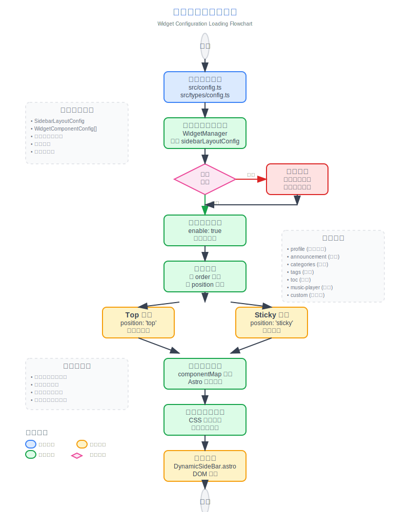

# 更新日志

## 🆕 v3.5

> 此版本始为个人独立分支

### v3.5.4

- **修复：**
- **优化：**
  - 评论组件样式
- **功能变更：**
  - 更换示例歌曲
  - 新增自建评论支持
  - 删除Umami统计支持，新增自建统计支持

### v3.5.3

- **修复：**
  - 下拉菜单重叠
  - 清理残余的i18n导入
  - 播放器无法点击调整进度
  - 404页面返回首页按钮消失
  - 特定操作下拉菜单无法收回
- **优化：**
  - full状态下顶部栏可读性
  - 公告栏关闭按钮悬停效果
  - 新增顶部栏图标（默认开启）
- **功能变更：**
  - 新增社交链接
  - 删除“技能展示”页面
  - 删除顶部栏“链接”按钮
  - 更改导航栏透明模式逻辑

### v3.5.2

- **修复：**
  - 清理过时的配置项
  - 清理残余的i18n导入
- **优化：**
  - 提升代码健壮性
  - 删除文档重复内容，添加引用
  - 根据设备时间自动启用深色模式
- **功能变更：**
  - 修改播放器隐藏逻辑
  - Footer 版本号链接至此仓库
  - 版权信息为无时，不显示高亮
  - 深色模式按钮只能在两种模式间切换
  - 提供“追番”功能开关（默认关闭）
  - 提供顶部栏“首页”按钮开关（默认关闭）

### v3.5.1

- **修复：**
  - 更新依赖
  - 一些代码问题
- **优化：**
  - 优化动画效果
  - 优化目录样式
  - 优化仓库文档分类
  - 优化播放器交互逻辑
  - 提升非透明状态下顶部栏及其下拉菜单可读性
- **功能变更：**
  - 删除樱花背景功能
  - 删除 Gitee 图标配置
  - 删除播放器组件歌曲封面旋转功能
  - 删除文章目录每个标题后附带的"#"
  - 删除i18n相关功能（感觉不如浏览器翻译插件
  - 主题色变更为自动轮换
  - 支持播放器组件进度条、音量条拖动
  - 取消底部栏部分字样与网站标题绑定

---

## 🆕 v3.4

- **新增页面：** 添加了项目展示、技能展示和时间线专属页面，用于展示您的工作、专业技能和成长历程。
- **下拉菜单修复：** 解决了下拉菜单点击时出现边框轮廓的问题，提升了界面一致性。
- **搜索功能优化：** 增强了搜索功能的性能和准确性。
- **底部HTML注入：** 引入了新功能，允许在页面底部注入自定义HTML内容，提供更大的灵活性。

## 🆕 v3.3

- **Mermaid 语法支持：** 添加了对 Mermaid 图表语法的支持，现在可以在 Markdown 中直接嵌入流程图、序列图、甘特图等。
- **Umami 访问统计：** 添加了对 Umami 访问统计的支持，可以轻松集成网站访问数据分析。

### 🔧 组件配置系统重构

- **统一配置架构：** 全新的模块化组件配置体系，支持动态组件管理和顺序配置
- **配置驱动的组件加载：** 重构 SideBar 组件，实现完全基于配置的组件加载机制
- **统一控制开关：** 移除音乐播放器和公告组件的独立 enable 开关，统一由 sidebarLayoutConfig 控制
- **响应式布局适配：** 组件支持响应式布局，可根据设备类型自动调整显示

### 📐 布局系统优化

- **侧边栏位置动态调整：** 支持左右侧边栏切换，布局自动适配
- **文章目录智能定位：** 当侧边栏在右侧时，文章导航自动移至左侧，提供更好的阅读体验
- **网格布局改进：** 优化 CSS Grid 布局，解决容器宽度异常问题

### 🎛️ 配置文件格式规范

- **标准化配置格式：** 创建统一的组件配置文件格式规范
- **类型安全：** 完善的 TypeScript 类型定义，确保配置的类型安全
- **可扩展性：** 支持自定义组件类型和配置选项

### 🧹 代码优化

- **测试文件清理：** 移除未使用的测试配置和依赖，减少项目体积
- **代码结构优化：** 改进组件架构，提升代码可维护性
- **性能提升：** 优化组件加载逻辑，提升页面渲染性能
