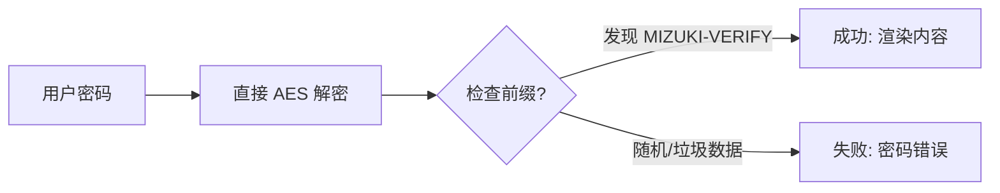

本博客模板基于 [Astro](https://astro.build/) 构建。如果在本文中找不到你需要的答案，请查阅 [Astro 文档](https://docs.astro.build/)。

## 文章的前置元数据 (Front-matter)

```yaml
---
title: 我的第一篇博客文章
published: 2023-09-09
description: 这是我的新 Astro 博客的第一篇文章。
image: ./cover.jpg
tags: [Foo, Bar]
category: 前端
draft: false
---
```

| 属性 | 描述 |
|---|---|
| `title` | 文章标题。 |
| `published` | 文章发布日期。 |
| `pinned` | 是否将文章置顶。 |
| `description` | 文章的简短描述。显示在首页列表中。 |
| `image` | 文章的封面图片路径。<br/>1. 以 `http://` 或 `https://` 开头：使用网络图片<br/>2. 以 `/` 开头：使用 `public` 目录下的图片<br/>3. 无前缀：相对于 markdown 文件的路径 |
| `tags` | 文章的标签。 |
| `category` | 文章的分类。 |
| `alias` | 文章的别名。文章将可以通过 `/posts/{alias}/` 访问。示例：`my-special-article` (将可以通过 `/posts/my-special-article/` 访问) |
| `licenseName` | 文章内容的许可协议名称。 |
| `author` | 文章作者。 |
| `sourceLink` | 文章内容的来源链接或参考。 |
| `draft` | 如果为 true，则视为草稿，不会在已发布列表中显示。 |

## 文章文件放置位置

文章文件应放置在 `src/content/posts/` 目录下。你也可以创建子目录来更好地组织文章和资源。

```txt
src/content/posts/
├── post-1.md
└── post-2/
    ├── cover.png
    └── index.md
```

## 文章别名

你可以通过在 front-matter 中添加 `alias` 字段来为任何文章设置别名：

```yaml
---
title: 我的特殊文章
published: 2024-01-15
alias: "my-special-article"
tags: ["示例"]
category: "技术"
---
```

设置别名后：

- 文章将可以通过自定义 URL 访问（例如 `/posts/my-special-article/`）
- 默认的 `/posts/{slug}/` URL 仍然有效
- RSS/Atom 源将使用自定义别名
- 所有内部链接将自动使用自定义别名

**重要提示：**

- 别名不应包含 `/posts/` 前缀（它会自动添加）
- 避免在别名中使用特殊字符和空格
- 为了最佳的 SEO 实践，请使用小写字母和连字符
- 确保别名在所有文章中是唯一的
- 不要包含前导或尾随斜杠

## 工作原理


